## Blockchain Absen Anti Titip Absen
Proyek ini merupakan implementasi sistem desentralisasi berbasis Blockchain untuk mengatasi permasalahan *Titip Absen* di lingkungan akademik. Dengan menggabungkan teknologi Distributed Ledger dan Digital Signature, kami memastikan setiap data kehadiran bersifat *aman, transparan, dan tidak dapat dimanipulasi*.


| Role                          | Name                              | NRP        |
|-------------------------------|-----------------------------------|------------|
| Backend & Core Blockchain     | Callista Meyra Azizah             | 5027231060 |
| Security & Digital Signature  | Fadlillah Cantika Sari Hermawan   | 5027231042 |
| Networking & Testing          | Aisyah Rahmasari                  | 5027231072   |

## Fitur Utama Sistem

### Digital Signature (ECDSA)
Menggunakan algoritma Elliptic Curve Digital Signature Algorithm (ECDSA) dengan kurva SECP256k1 untuk memastikan bahwa hanya pemilik Private Key asli yang dapat melakukan absensi.

### Miner Reward
Setiap proses mining akan menghasilkan transaksi tambahan berupa **SYSTEM_REWARD** sebagai bentuk insentif bagi node yang melakukan validasi blok.

### Integritas Data (Anti-Tampering)
Jika data transaksi diubah meskipun hanya satu karakter, maka signature menjadi tidak valid dan transaksi akan ditolak oleh sistem.

---

## Panduan Menjalankan Sistem

### 1. Install Dependency
```bash
pip install flask ecdsa requests
````

---

### 2. Jalankan Server

```bash
python app.py
```

Server akan berjalan di:

```
http://127.0.0.1:5000
```

---

### 3. Generate Identitas Digital

```bash
python wallet.py
```

Output:

```json
{
  "nama": "Tywin Lannister",
  "keterangan": "Hadir",
  "public_key": "...",
  "signature": "..."
}
```

---
## Cara Run:

1. Jalankan ``python app.py``
2. Di Postman, buka tab `POST /transactions/new`. Masukkan nama baru. Klik Send.
3. Lihat pesannya: "Absen (nama) masuk antrian Blok (nomer antrian)".
4. Buka tab `GET /mine.` Klik Send.
5. Lihat Hasilnya: Di hasil Blok (nomer antrian) ini, daftar transactions pasti akan berisi **DUA data: Data (nama) dan Data SYSTEM_REWARD.**

## Dokumentasi (Sebelum menambahkan security):

Hasil `GET /mine` pertama 


Hasil `GET /chain` pertama 


Hasil `POST /transactions/new` (absensi baru) 


Hasil `GET /mine` kedua, menambahkan 1 orang-Tywin Lannister


Hasil `GET /chain` kedua, menambahka 1 orang-Tywin Lannister


## Dokumentasi (Setelah menambahkan security):

1. Identitas Digital didapat dengan Menjalankan wallet.py untuk mendapatkan data otentikasi (Tywin Lannister).


2. Pengujian Penambahan Transaksi Valid (POST) menggunakan url ```http://127.0.0.1:5000/absen```


3.  Pengujian Validasi Keamanan (POST - Error)
   
Kalau namanya ga sesuai dengan data otentikasi maka absen gagal kara signature nya tidak valid.


4. Pengujian Proses Mining (GET)
   
Data Tywin yang tadi sudah lolos verifikasi ke dalam blockchain. Terlihat hasilnya di bagian transactions, akan terlihat data Tywin Lannister dan SYSTEM_REWARD.


5. Menampilkan seluruh chain. Terdapat data Tywin Lannister dengan Signature asli yang rumit, bukan lagi tulisan "DUMMY".
   


---

## Testing Study Cases 

### Persiapan Awal (Prerequisites)

1. Jalankan 3 node pada terminal berbeda:

```bash
python app.py 5000
python app.py 5001
python app.py 5002
```

2. Generate data mahasiswa:

```bash
python wallet.py
```

3. Copy output JSON (contoh: Tywin Lannister)
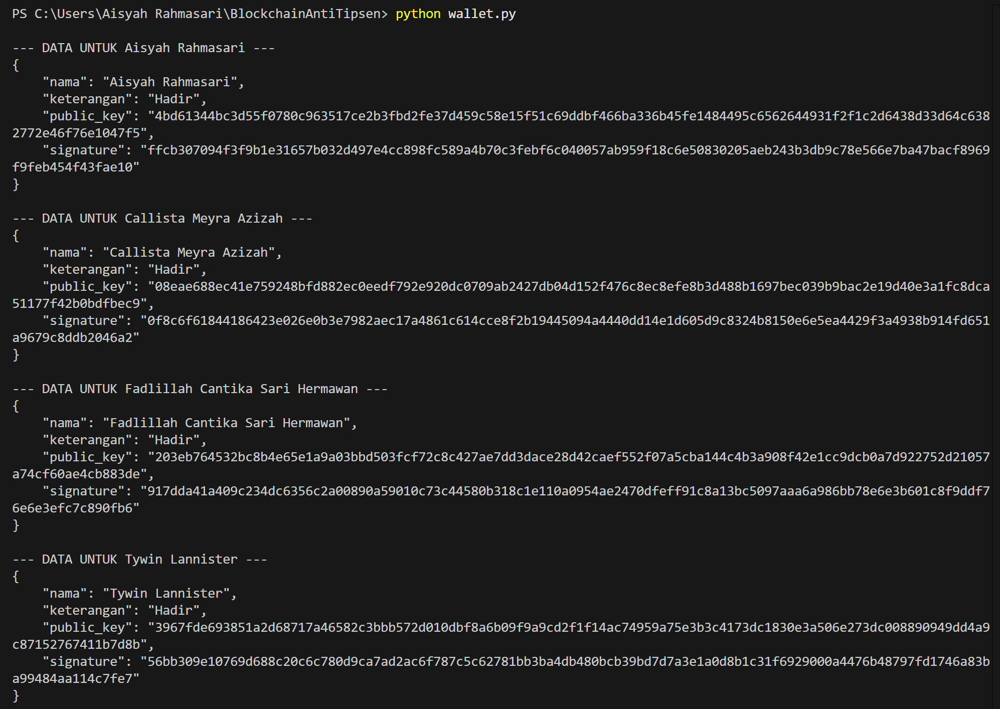

---

## Study Case 1: Networking (Registrasi Node)

**Tujuan:** Menghubungkan node agar dapat saling berkomunikasi

* Method: `POST`
* URL:

```
http://127.0.0.1:5000/nodes/register
```

* Body (JSON):

```json
{
  "nodes": [
    "http://127.0.0.1:5001",
    "http://127.0.0.1:5002"
  ]
}
```

* Node berhasil terdaftar
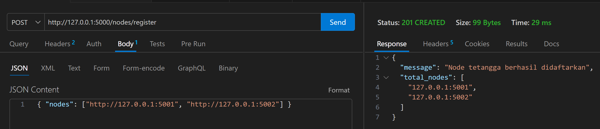

---

## Study Case 2: Penambahan Transaksi Valid 

**Tujuan:** Memastikan absen berhasil jika data valid

* Method: `POST`
* URL:

```
http://127.0.0.1:5000/absen
```

* Body:
  Gunakan JSON dari `wallet.py`

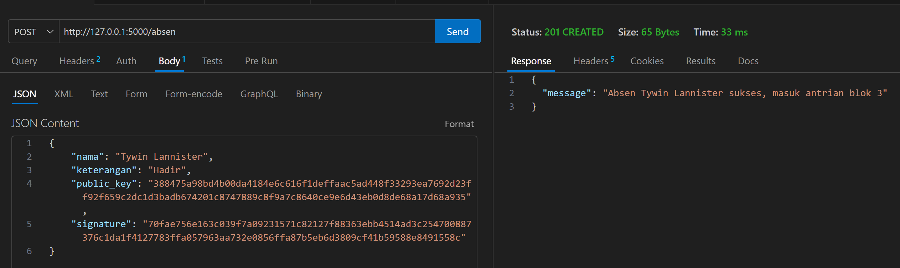

* **Hasil:**
- Transaksi berhasil masuk ke antrian blok
- Response status: 201 Created

---

## Study Case 3: Anti-Titip Absen (Manipulasi Data)

**Tujuan:** Membuktikan sistem menolak manipulasi

**Langkah:**

* Ubah:

```json
"keterangan": "Hadir"
"nama": "Tywin Lannister"
```

menjadi:

```json
"keterangan": "Izin"
"nama": "Tywinn Lannister"
```

* **Jangan ubah signature**

**Ekspektasi:**

* Status: `401 Unauthorized`
* Message:
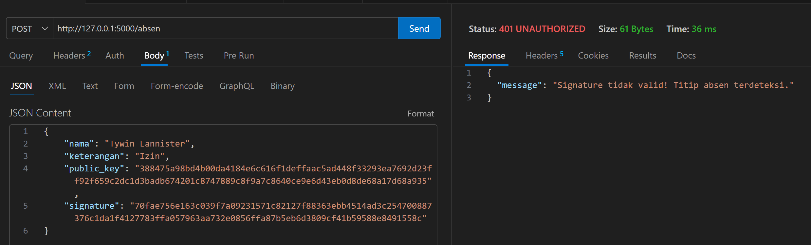
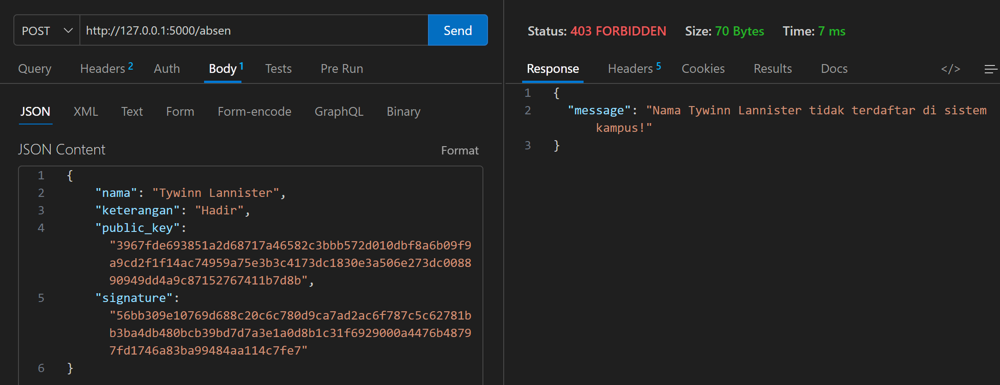

* **Hasil:**
- Status: 401 Unauthorized
- Status: 403 FORBIDDEN
- Sistem menolak transaksi karena signature tidak sesuai dengan data

---

## Study Case 4: Miner Reward (Insentif Ekonomi)

**Tujuan:** Membuktikan miner mendapat reward

* Method: `GET`
* URL:

```
http://127.0.0.1:5000/mine
```

Lalu cek:

```
http://127.0.0.1:5000/chain
```

**Ekspektasi:**

* Terdapat 2 transaksi:

  * Data mahasiswa
  * `SYSTEM_REWARD` ke `Admin_Node_5000`

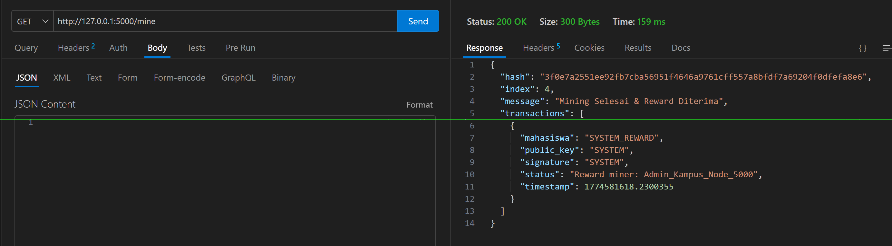
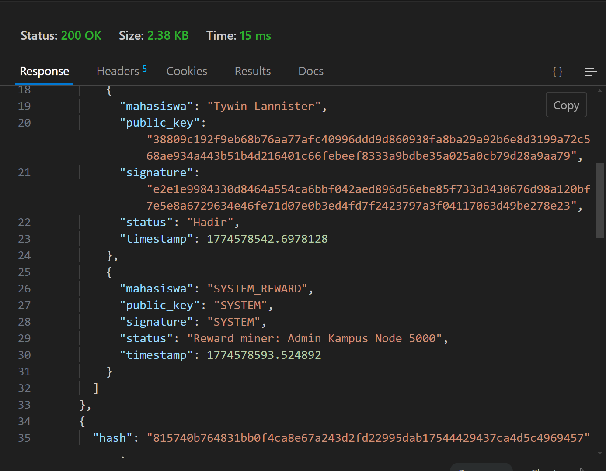
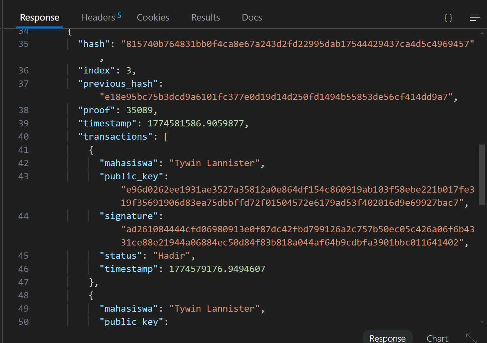
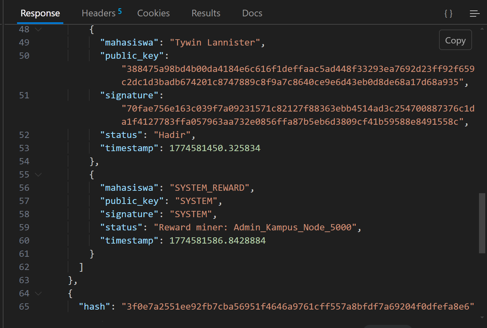
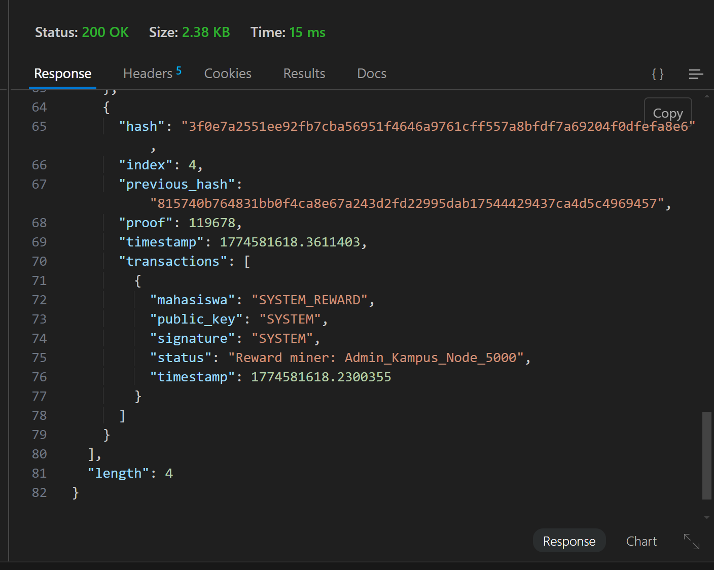
---

## Study Case 5: Konsensus & Sinkronisasi

**Tujuan:** Membuktikan longest chain rule. Proses ini menggunakan prinsip consensus “Longest Chain Rule”, di mana node dengan chain lebih pendek akan mengadopsi chain yang lebih panjang dan valid dari node lain.

### Langkah langkah

1. Lakukan transaksi dan mining di Node 5000 (Rantai sekarang paling panjang).
2. Cek Node 5001 dan Node 5002, pastikan keduanya masih di blok awal (Blok 1).
3. Lakukan sinkronisasi pada Node 5001: GET http://127.0.0.1:5001/nodes/resolve
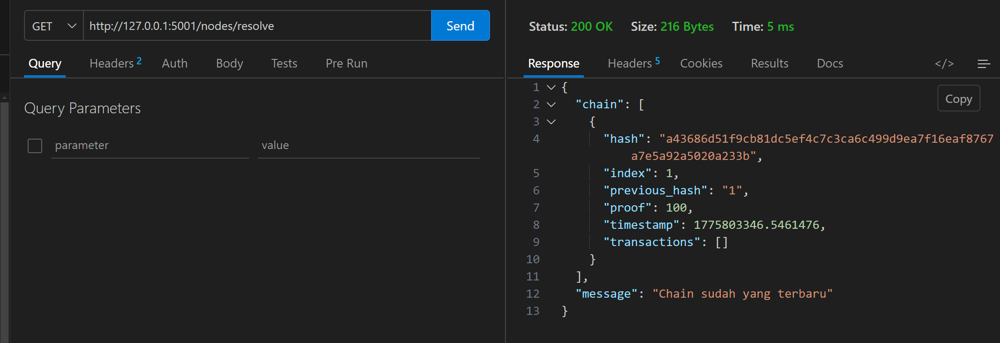
4. Lakukan sinkronisasi pada Node 5002: GET http://127.0.0.1:5002/nodes/resolve
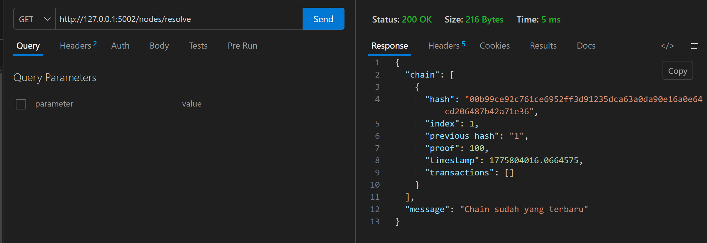

Kedua node (5001 & 5002) akan mengadopsi chain dari Node 5000. Ini membuktikan bahwa seluruh jaringan tetap memiliki data yang konsisten meskipun transaksi hanya dilakukan di satu node.

---

## Study Case 6: Integritas Blockchain (Hashing)

**Tujuan:** Membuktikan blok saling terhubung. Pada Study Case 6, kami membuktikan integritas rantai (Chain Integrity). Blok ke-2 menyimpan nilai previous_hash yang berasal dari hash Blok ke-1. Hal ini menunjukkan bahwa setiap blok saling terhubung secara kriptografis. Jika data pada Blok ke-1 diubah, maka hash-nya akan berubah dan menyebabkan ketidaksesuaian dengan previous_hash pada Blok ke-2. Akibatnya, seluruh rantai setelahnya menjadi tidak valid. Inilah yang membuat blockchain bersifat Immutable (tidak dapat diubah)

Selain keterhubungan antar blok, sistem kami juga menjamin integritas data melalui penyimpanan lokal (blockchain_data_port.json). Jika salah satu server mati, sistem akan memuat ulang data dari file ini dan melakukan verifikasi ulang terhadap seluruh hash sebelum server siap melayani transaksi. Hal ini mencegah manipulasi data saat server dalam kondisi offline

* Method: `GET`

```
http://127.0.0.1:5000/chain
```

**Analisis:**

* Bandingkan:

  * `hash` block ke-1
  * `previous_hash` block ke-2

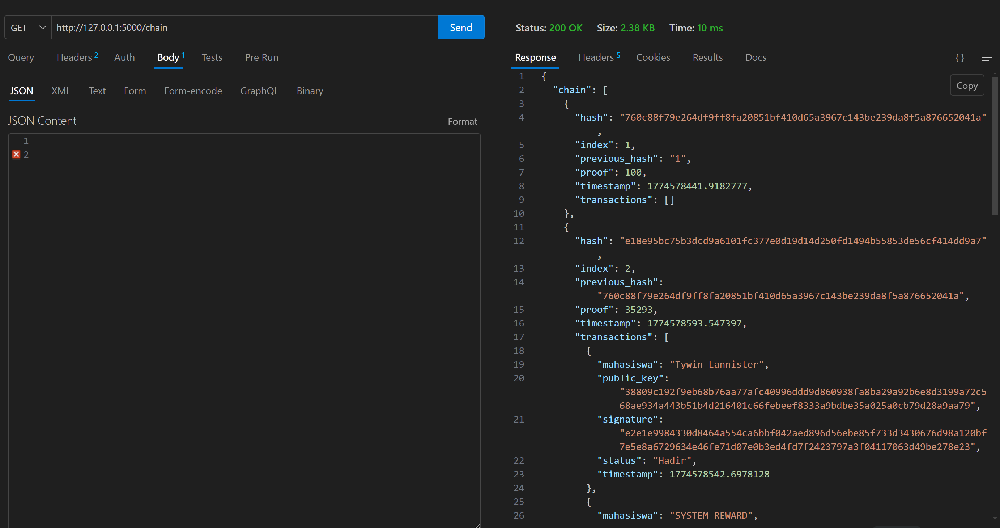

---

## Checklist Pengujian

- [x] Registrasi Node berhasil
- [x] Transaksi valid berhasil masuk
- [x] Manipulasi data ditolak sistem
- [x] Mining menghasilkan reward
- [x] Konsensus antar node berjalan
- [x] Integritas hash terbukti
- [x] Data Persistence: (Data tidak hilang saat server restart karena tersimpan di JSON)

---


